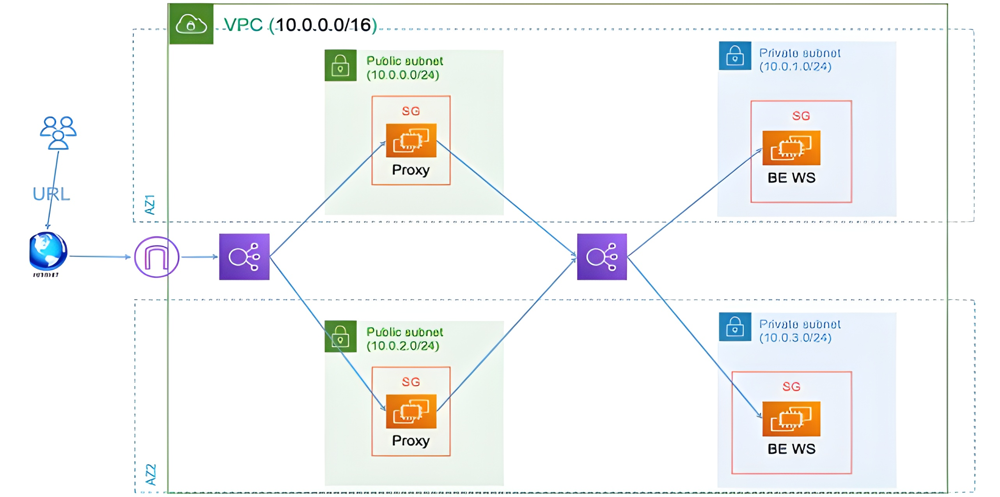
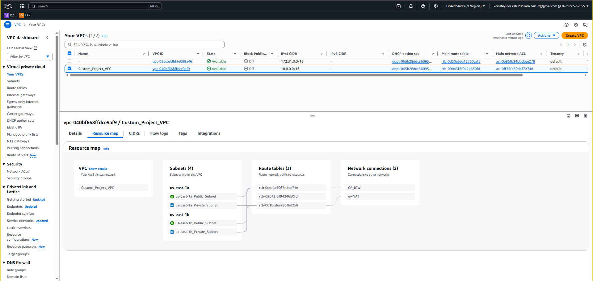
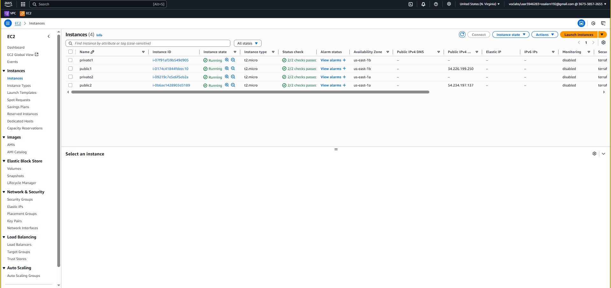
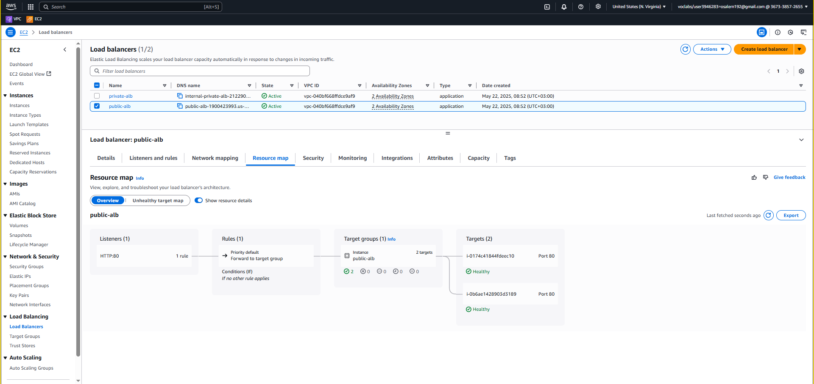
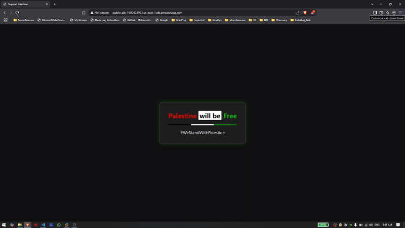

# Terraform Infrastructure Deployment

This project contains Terraform configuration to deploy a modular cloud infrastructure including:
- VPC
- Subnets
- Security Groups
- EC2 Instances
- Application Load Balancer (ALB)

## 📁 Project Structure

```
terraform/
├── main.tf
├── variables.tf
├── output.tf
├── vpc/
│   ├── main.tf
│   ├── variable.tf
│   └── output.tf
├── subnet/
│   ├── main.tf
│   ├── variable.tf
│   └── output.tf
├── sg/
│   ├── main.tf
│   ├── variable.tf
│   └── output.tf
├── ec2/
│   ├── main.tf
│   ├── variable.tf
│   └── output.tf
├── alb/
│   ├── main.tf
│   ├── variable.tf
│   └── output.tf
└── scripts/
    ├── private_us-east-1a.sh
    ├── private_us-east-1b.sh
    └── nginx_install.sh
```

## AWS Diagram



## 📦 Modules

### VPC and Subnets



### EC2



### Public ALB



### Private ALB


## Final Load-Balancing


## 🔧 Usage

### Prerequisites
- Terraform installed
- AWS credentials configured (`~/.aws/credentials` or via environment variables)

### Initialize Terraform
```bash
terraform init
```

### Plan Deployment
```bash
terraform plan
```

### Apply Deployment
```bash
terraform apply
```

### Destroy Infrastructure
```bash
terraform destroy
```

## 📥 Variables

Variables are defined in `variables.tf` and module-specific `variable.tf` files.

Examples:
- `region`: AWS region to deploy to
- `vpc_cidr`: CIDR block for the VPC
- `instance_type`: EC2 instance type

## 📤 Outputs

Outputs from `output.tf` expose useful information such as:
- VPC ID
- Public IPs
- Load balancer DNS name

## 📜 Scripts

Scripts in the `scripts/` folder are used to configure EC2 instances (install NGINX, configure it as reverse-proxy and install apache on private instances).

## 📝 Note

- Ensure that your IAM user/role has the appropriate permissions to create networking, compute, and load balancing resources.

## Author
This Was Created By ***Omar Ahmed Salem*** under Supervision of ***Mohamed Swelam***  